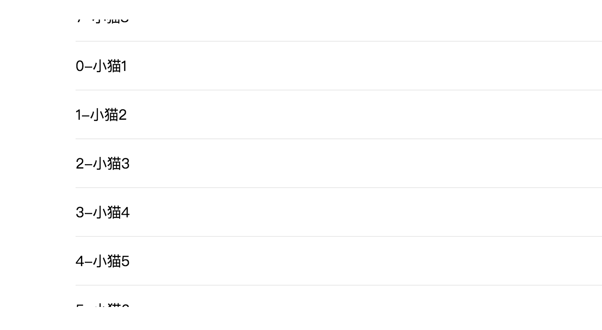

# vue-line-scroll
## 基于vue的list数据循环滚动
###  安装
``` npm install  vue-line-scroll```
### 使用
1.手动控制，手动控制每个item数据显示，一条一条数据预留
2.循环滚动数据显示

```javascript

<template>
  <div class="container">
    <h4>手动控制滚动</h4>
    <button @click="moveDown">下移动</button>
    <button @click="moveUp">上移动</button>

    <StepScroll
      ref="scroll"
      :itemHeight="55"
      :len="list.length"
      height="330px"
    >
      <Item
        v-for="(item,index) in list "
        :item="item"
        :index="index+1"
        :key="index"
      />
    </StepScroll>
    <h4>自动循环滚动</h4>
    <Scroll
      :itemHeight="55"
      :len="list.length"
      height="324px"
    >
      <Item
        v-for="(item,index) in scrollData "
        :item="item"
        :index="index>(list.length-1)?index-list.length:index"
        :key="index"
      />
    </Scroll>
  </div>
</template>

<script>
import Item from "@c/item.vue";
import { Scroll, StepScroll } from "../dist/vue-line-scroll.js";

export default {
  data() {
    return {
      list: []
    };
  },
  created() {
    setTimeout(() => {
      this.list = [
        { text: "小猫1" },
        { text: "小猫2" },
        { text: "小猫3" },
        { text: "小猫4" },
        { text: "小猫5" },
        { text: "小猫6" },
        { text: "小猫7" },
        { text: "小猫8" },
        { text: "小猫9" },
        { text: "小猫10" },
        { text: "小猫11" },
        { text: "小猫12" },
        { text: "小猫13" },
        { text: "小猫14" },
        { text: "小猫15" }
      ];
      this.originData = JSON.parse(JSON.stringify(this.list));
      this.list[0].active = true;
    }, 10);
  },
  computed: {
    scrollData() {
      return [...this.list, ...this.list];
    }
  },
  methods: {
    moveDown() {
      let index = this.$refs.scroll.moveDown();
      if (!index) {
        return;
      }
      this.setData(index - 1);
    },
    moveUp() {
      let index = this.$refs.scroll.moveUp();
      if (!index) {
        return;
      }
      this.setData(index - 1);
    },
    setData(index) {
      this.list = [
        ...this.originData.slice(0, index),
        { ...this.originData[index], active: !this.originData[index].active },
        ...this.originData.slice(index + 1)
      ];
    }
  },
  components: {
    Item,
    Scroll,
    StepScroll
  }
};
</script>

<style lang="less" scoped>
.container {
  width: 600px;
  margin: 50px auto;
}
</style>
```
### 说明
 
|  参数        | 说明  |
|  ----       | ----  |
| itemHeight  | 每项高度 |
| height       | 容器高度 |
| len          | 原始数据长度 |

###  效果

